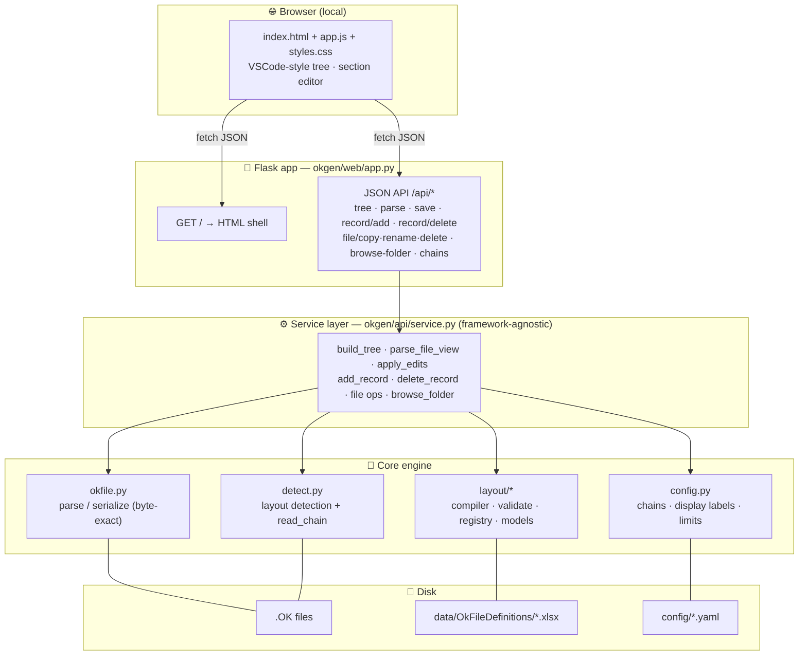
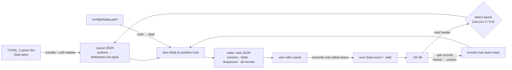
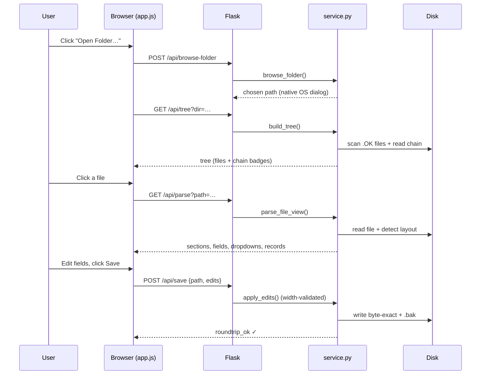
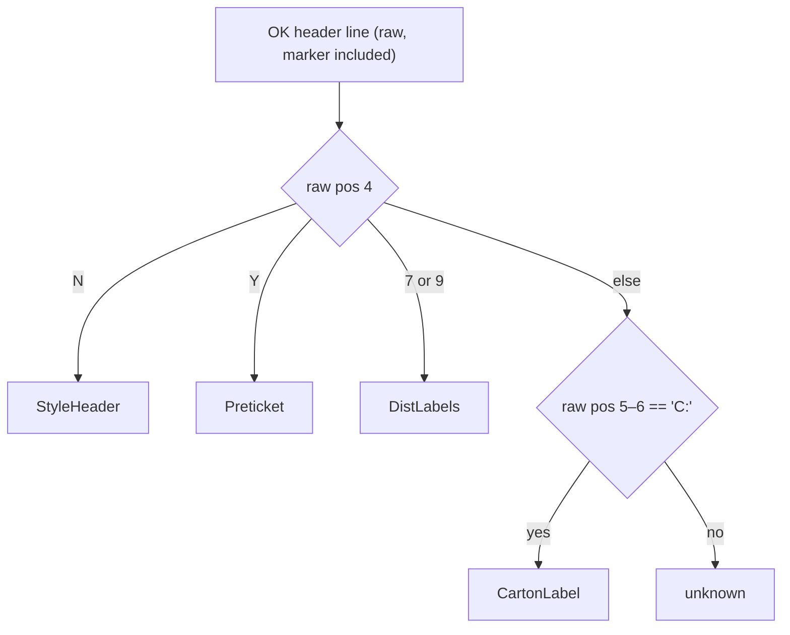
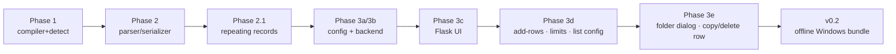

# OkGen — Architecture

Diagrams render automatically on GitHub (Mermaid). For prose, see
[IMPLEMENTATION_PLAN.md](IMPLEMENTATION_PLAN.md).

## 1. Components & layers

**Key idea:** all real logic lives in the **service layer + core engine**, which
know nothing about Flask. The Flask layer is a thin HTTP wrapper. Swapping the
browser UI for React later means reusing the same `/api/*` endpoints — the Python
does not change.

## 2. Data: how a file becomes an editable form

The position model: xlsx `Position` is 1-based **into the marker-stripped
record**; the leading marker (`|` / `#` / `&` / `¦`) shifts raw positions by 1.
Editing overwrites only a field's span, so untouched bytes round-trip exactly.

## 3. Request flow: opening and saving a file

## 4. Detection rule (which layout?)

## 5. Build phases (each a git tag / checkpoint)

